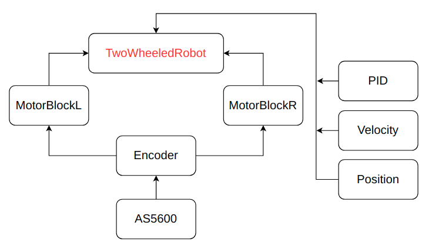

# Differential Drive Robot

## Introduction

This project is designed to control a mobile differential drive robot.

## Repository structure
> lib  
>> AS5600  
>> Encoder  
>> InitData  
>> Motor  
>> PID  
>> Position  
>> TwoWheeledRobot  
>> Velocity

>src
>> main.cp

> scripts
>> SocketServer.py  
>> SocketClient.py

## Robot design

The robot includes the following devices and sensors:

- Single board computer **Raspberry pi 4 8gb**
- Hardware platform **Arduino Mega 2560**
- Motor driver **TB6612FNG**
- Hall-Effect Magnetic Encoder **AS5600 x2**
- I2C Multiplexer **CJMCU-9548 (for encoders)**

Below is the connection of all elements

## Dependencies

### **PlatformioIO**

This code works on Arduino Mega 2560 using **PlatformioIO**

You can download [PlatformIO Core](https://docs.platformio.org/en/latest/core/installation.html#piocore-install-shell-commands) separately.

Or use the [Visual Studio Code IDE Extension](https://platformio.org/install/ide?install=vscode).

(Please note that you do not need to install PlatformIO Core if you are going to use PlatformIO IDE. PlatformIO Core is built into PlatformIO IDE and you will be able to use it within PlatformIO IDE Terminal.)

### AS5600

This code uses a third party library AS5600 licensed under the [GPL-3.0 License](https://choosealicense.com/licenses/gpl-3.0/)

## Classes

<!--  -->


## Using

Clone the repository:

```arduino
git clone https://github.com/industrial-robotics-lab/differential-drive-robot.git
```

## Robot control

## License

[MIT](https://choosealicense.com/licenses/mit/)
